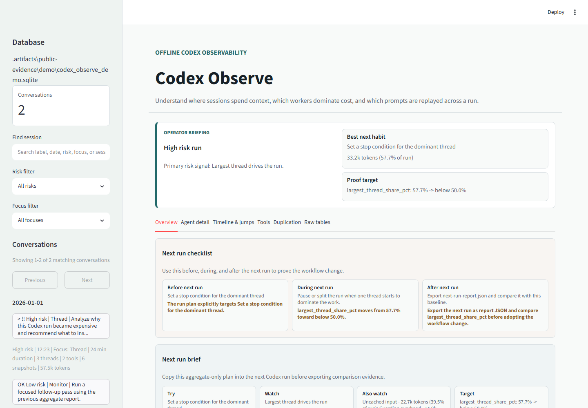

# Codex Observe

[](https://github.com/LangFelixAT/codex-observe/actions/workflows/ci.yml)
[](https://www.python.org/)
[](LICENSE)

**Offline observability dashboard for Codex JSONL session logs.**

Codex Observe turns local session history into an answer-first review: what made a run expensive, what habit to change next, and how to prove the next run improved. It runs locally, uses SQLite, and does not require uploading your conversations.



_The screenshot above is generated from the repository's synthetic demo data._

## What it helps you answer

- Which run needs attention, and why?
- Did one thread, repeated context, guardian review, or tool output dominate cost?
- What concrete habit should change on the next run?
- Did the next run actually improve against the baseline?

The dashboard combines a selected-run briefing, portfolio patterns, risk and focus filters, bounded history navigation, run comparisons, diagnostics, agent detail, timeline jumps, tool usage, duplication analysis, and aggregate-only report downloads.

## Quick start

Codex Observe supports Python 3.10, 3.11, and 3.12. The current distribution is a source checkout:

```bash
git clone https://github.com/LangFelixAT/codex-observe.git
cd codex-observe
python -m pip install -e .
```

### Synthetic demo

Try the complete product without reading private logs:

```bash
codex-observe demo --serve --host 127.0.0.1 --port 8501
```

Open <http://127.0.0.1:8501>. The demo contains an older high-risk run and a newer low-risk follow-up so the diagnosis and comparison workflow are visible immediately.

### Your Codex sessions

First resolve the sessions path without scanning it:

```bash
codex-observe paths
```

Then build an ignored local review of the newest 25 session files and open it:

```bash
codex-observe private-validate ~/.codex/sessions --serve --host 127.0.0.1 --port 8501
```

On Windows, `codex-observe paths` resolves `%USERPROFILE%\.codex\sessions` and prints the equivalent command. Use the emitted `--all` follow-up only when you want to rebuild from the full history.

## Core workflow

1. **Diagnose:** choose the highest-risk run and inspect its primary cost driver.
2. **Act:** use the generated next-run brief as the operating constraint for the next session.
3. **Prove:** compare the baseline and follow-up reports instead of relying on intuition.

```bash
codex-observe sessions --db <db>
codex-observe report --db <db> --format json --out before.json
# Run the next Codex session, ingest it, then export after.json.
codex-observe compare --before-report before.json --after-report after.json --out comparison.md
```

## Commands

| Command | Purpose |
| --- | --- |
| `codex-observe tour` | Print the concise synthetic walkthrough |
| `codex-observe demo` | Generate representative synthetic sessions |
| `codex-observe paths` | Resolve local paths without scanning logs |
| `codex-observe private-validate` | Build a bounded, ignored real-session review |
| `codex-observe ingest` | Import JSONL sessions into SQLite |
| `codex-observe sessions` | Rank aggregate-only sessions by risk and focus |
| `codex-observe report` | Export an actionable Markdown or JSON run report |
| `codex-observe compare` | Compare two runs and evaluate workflow change |
| `codex-observe doctor` | Check database health without printing raw content |
| `codex-observe serve` | Open an existing database in the dashboard |
| `codex-observe evidence-bundle` | Build a synthetic reviewer evidence bundle |
| `codex-observe audit` | Verify release evidence and project contracts |

Run `codex-observe <command> --help` for complete options.

## Privacy

Codex Observe is local-first:

- Session JSONL, SQLite databases, private reports, and private screenshots stay on your machine by default.
- The application does not intentionally send session content to external services.
- Terminal summaries and exported reports avoid raw prompts, message text, tool arguments, and tool output.
- Screenshots and aggregate metrics can still reveal sensitive context; review them before sharing.
- Generated local evidence lives under ignored `.artifacts/` paths.

See [Limitations](docs/LIMITATIONS.md) and [real-log feedback guidance](docs/REAL_LOG_FEEDBACK.md) for the full boundary.

## Development

Install the development dependencies and Chromium runtime:

```bash
python -m pip install -e ".[dev]"
python -m playwright install chromium
```

Run the core gates:

```bash
ruff check
ruff format --check
pytest -q
python scripts/clean_install_smoke.py --extra dev
```

Regenerate and verify synthetic browser evidence:

```bash
codex-observe demo
python scripts/visual_qa.py
python scripts/visual_qa.py --verify-manifest .artifacts/visual/visual-qa-manifest.json
codex-observe evidence-bundle --out .artifacts/public-evidence
codex-observe audit --json
```

The visual manifest binds desktop, narrow, and onboarding captures by exact byte size and SHA-256. See [CONTRIBUTING.md](CONTRIBUTING.md) for test, traceability, fixture, and privacy requirements.

## Documentation

- [Current project state](docs/CURRENT.md)
- [Distribution and supported environments](docs/DISTRIBUTION.md)
- [Known limitations](docs/LIMITATIONS.md)
- [Release checklist](docs/RELEASE.md)
- [Changelog](CHANGELOG.md)

## Status

Version 0.3.0 is the first presentable source-install release. PyPI publishing, binary installers, hosted mode, telemetry, and external report upload are not enabled.
